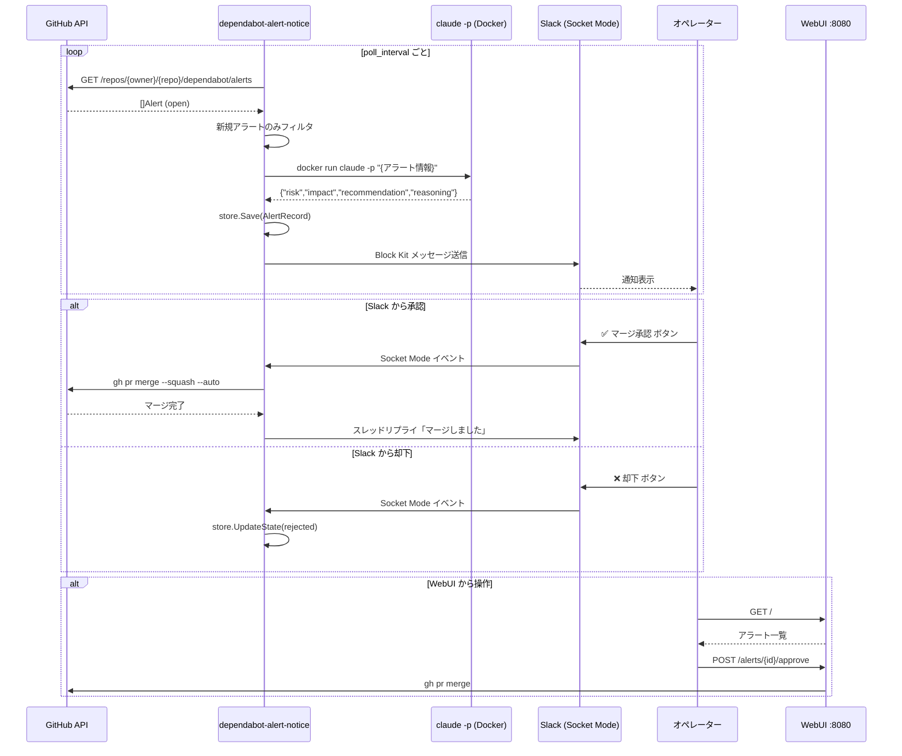
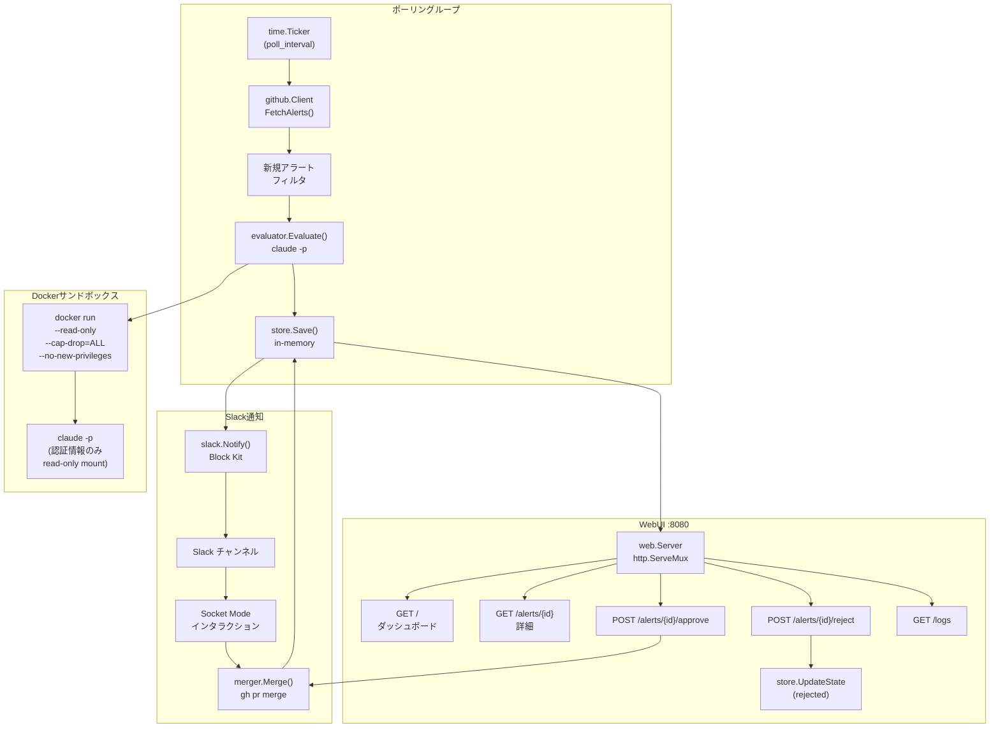
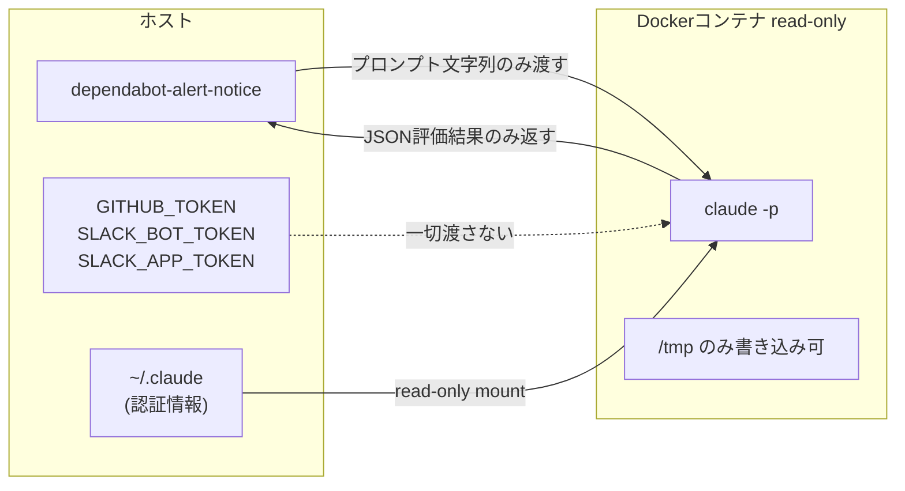
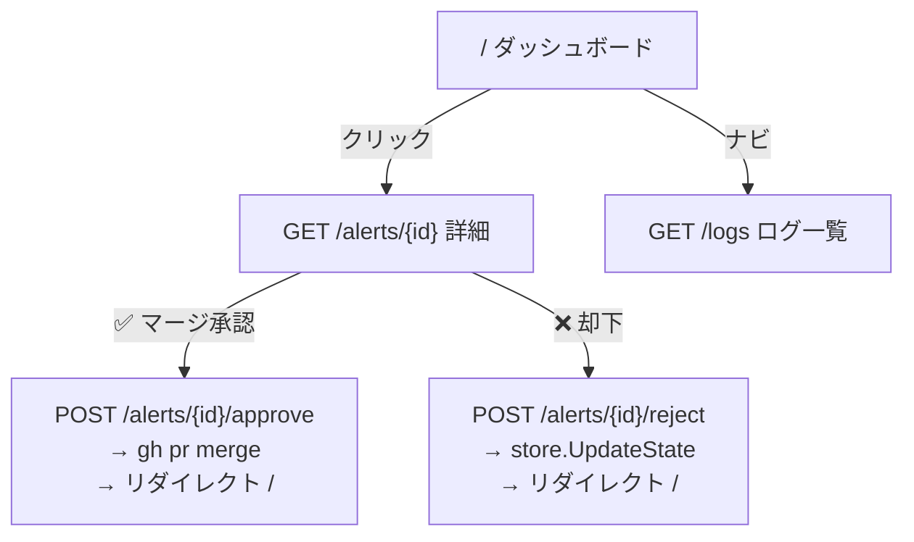

# dependabot-alert-notice

GitHub Dependabotアラートを定期ポーリングし、`claude -p` でAI評価 → Slack通知 → ボタン承認でPR自動マージを行うGoアプリケーション。

## フロー



## アーキテクチャ



## セキュリティ: claude -p のDocker隔離

Dependabotアラートのパッケージ名・CVE説明文にプロンプトインジェクションが仕込まれる可能性があるため、`claude -p` を専用コンテナで実行する。



**隔離の効果:**
- ホストの `GITHUB_TOKEN` / `SLACK_*` トークンへアクセス不可
- ホストファイルシステムへの書き込み不可（`--read-only`）
- 全 Linux capability を削除（`--cap-drop=ALL`）
- メモリ 512MB / CPU 0.5 コア制限

## WebUI



### ダッシュボード (`/`)

| カラム | 内容 |
|---|---|
| ID | アラートID（詳細ページへのリンク） |
| パッケージ | 影響パッケージ名 |
| リポジトリ | `owner/repo` |
| 重要度 | critical / high / medium / low バッジ |
| CVE | CVE-XXXX-XXXXX |
| AI評価 | approve / reject / manual-review バッジ |
| ステータス | pending / approved / rejected / merged バッジ |
| 操作 | 承認・却下ボタン（pending のみ表示） |

### 詳細ページ (`/alerts/{id}`)

- アラート全情報（パッケージ、エコシステム、CVSS、概要、修正バージョン）
- AI評価（リスク、推奨、影響、理由）
- 承認・却下ボタン

### ログページ (`/logs`)

- ポーリング・AI評価・マージ操作のログを新しい順で表示

## セットアップ

### 1. 設定ファイル作成

```bash
cp config.yaml.example config.yaml
# config.yaml を編集
```

```yaml
poll_interval: 30m
targets:
  - owner: your-org
    repo: your-repo
slack:
  channel_id: C0123456789
```

```bash
export SLACK_BOT_TOKEN=xoxb-...
export SLACK_APP_TOKEN=xapp-...
```

### 2. Dockerイメージビルド（claude -p 隔離用）

```bash
eval "$(devbox shellenv)"
make build-evaluator-image
```

### 3. 実行

```bash
# 1回だけ実行（テスト）
go run . -once -config config.yaml

# 常駐実行
go run . -config config.yaml

# WebUI: http://localhost:8080
```

## Slack アプリ設定

Slack アプリに以下の設定が必要:

- **Socket Mode**: 有効
- **Bot Token Scopes**: `chat:write`, `chat:write.public`
- **Interactivity**: 有効（Socket Mode使用のためRequest URLは不要）

## 設定リファレンス

| キー | デフォルト | 説明 |
|---|---|---|
| `poll_interval` | `30m` | ポーリング間隔 |
| `targets[].owner` | 必須 | GitHubオーナー名 |
| `targets[].repo` | 省略可 | リポジトリ名（省略でorg全体） |
| `slack.channel_id` | 必須 | 通知先チャンネルID |
| `claude_path` | `claude` | claude CLIパス |
| `gh_path` | `gh` | gh CLIパス |
| `log_level` | `info` | ログレベル |
| `web.port` | `8080` | WebUIポート |
| `evaluator.sandbox.enabled` | `true` | Docker隔離の有効/無効 |

## 開発

```bash
eval "$(devbox shellenv)"   # Go環境有効化（devbox必須）
go build ./...              # ビルド
go test ./... -v -race      # テスト（全パッケージ）
go vet ./...                # 静的解析
```
