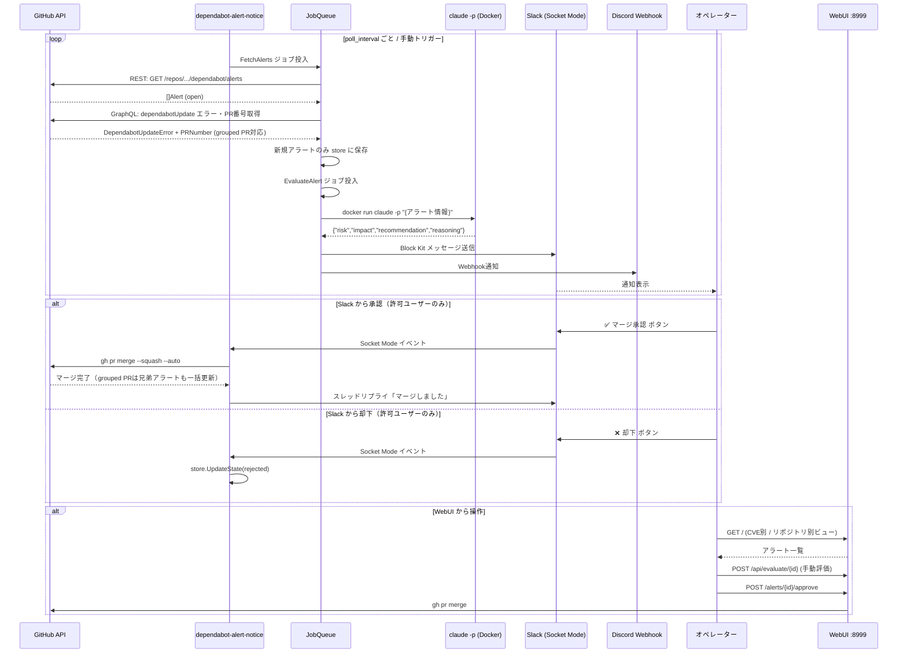
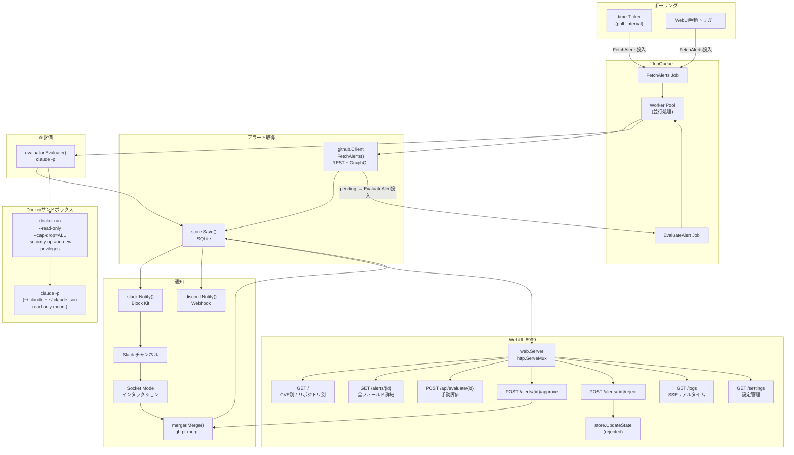
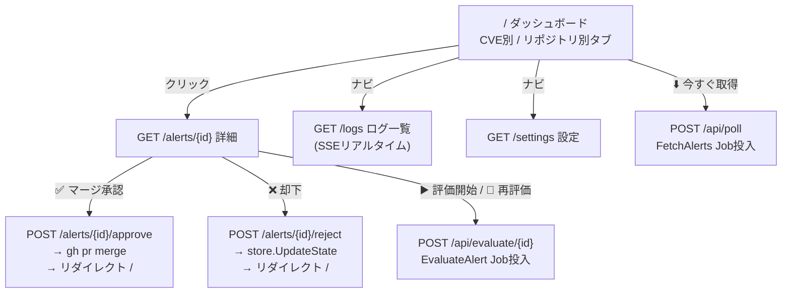
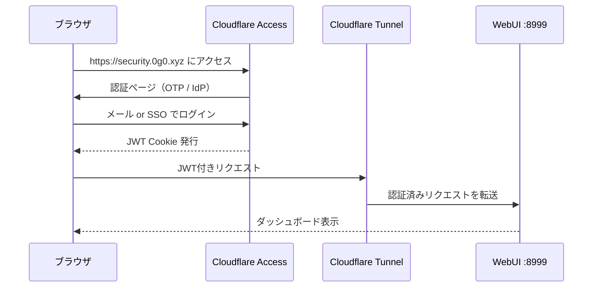

# dependabot-alert-notice

GitHub Dependabotアラートを定期ポーリングし、`claude -p` でAI評価 → Slack/Discord通知 → ボタン承認でPR自動マージを行うGoアプリケーション。

## フロー



## アーキテクチャ



## セキュリティ: claude -p のDocker隔離

Dependabotアラートのパッケージ名・CVE説明文にプロンプトインジェクションが仕込まれる可能性があるため、`claude -p` を専用コンテナで実行する。

```mermaid
graph LR
    subgraph ホスト
        App["dependabot-alert-notice"]
        Secrets["GITHUB_TOKEN\nSLACK_BOT_TOKEN\nSLACK_APP_TOKEN"]
        ClaudeHome["~/.claude\n(認証情報ディレクトリ)"]
        ClaudeJSON["~/.claude.json\n(設定ファイル)"]
    end

    subgraph Dockerコンテナ read-only
        ClaudeCLI["claude -p"]
        TmpFS["/tmp のみ書き込み可"]
    end

    App -->|"プロンプト文字列のみ渡す"| ClaudeCLI
    ClaudeHome -->|"read-only mount"| ClaudeCLI
    ClaudeJSON -->|"read-only mount"| ClaudeCLI
    Secrets -.->|"一切渡さない"| ClaudeCLI
    ClaudeCLI -->|"JSON評価結果のみ返す"| App
```



**隔離の効果:**
- ホストの `GITHUB_TOKEN` / `SLACK_*` トークンへアクセス不可
- ホストファイルシステムへの書き込み不可（`--read-only`）
- 全 Linux capability を削除（`--cap-drop=ALL`）
- 新規権限昇格禁止（`--security-opt=no-new-privileges`）
- メモリ 512MB / CPU 0.5 コア制限

## WebUI



### ダッシュボード (`/`)

**CVE別ビュー** (`/?view=cve`) — デフォルト
- CVE ID 単位でアラートをグルーピング
- Severity降順 → CVSS降順でソート

**リポジトリ別ビュー** (`/?view=repo`)
- `owner/repo` 単位でグルーピング
- 各グループ内にパッケージ・CVE・AI評価・ステータス・操作列

| 機能 | 説明 |
|---|---|
| 展開状態の保持 | `<details>` の開閉状態はsessionStorageで永続化、リロード後も復元 |
| GitHubリンク | 各アラート行に ↗ アイコンでGitHubの該当ページへ直リンク |
| 自動更新 | AI評価中のアラートがある場合、5秒間隔で自動リロード |
| 手動取得 | 「今すぐ取得」ボタンでJobQueueにFetchJobを投入 |

### 詳細ページ (`/alerts/{id}`)

GitHub Dependabot REST API + GraphQL API の全情報を表示:

| セクション | 内容 |
|---|---|
| **更新エラー** | Dependabotが更新できない場合の理由（GraphQL `dependabotUpdate.error` 由来） |
| **アラート情報** | パッケージ、リポジトリ、重要度、CVE、GHSA、CVSSスコア・ベクトル、EPSS、概要、修正バージョン、脆弱バージョン範囲、マニフェストパス、スコープ、依存関係種別、検出日・更新日・公開日 |
| **詳細説明** | `security_advisory.description`（Markdown形式の脆弱性説明） |
| **CWE** | Common Weakness Enumeration 一覧 |
| **参照リンク** | NVD、アドバイザリ等の外部リンク |
| **AI評価** | 推奨アクション、侵害内容、侵害される使い方。手動で評価開始/再評価可能 |

### ログページ (`/logs`)

- ポーリング・AI評価・マージ操作のログをSSEでリアルタイム表示

### 設定ページ (`/settings`)

- ポーリング間隔・直近活動フィルタ、監視ターゲット・除外リポジトリ、Slack/Discord設定、通知最低重要度、AI自動評価・評価最低重要度、サンドボックス設定をWebUIから変更可能

## セットアップ

### 1. 設定ファイル作成

```bash
cp config.yaml.example config.yaml
# config.yaml を編集
```

```yaml
poll_interval: 30m
active_months: 6  # 直近6か月以内にpushがあったリポのみ対象（0=無効）
targets:
  - owner: your-org
    repo: your-repo
slack:
  channel_id: C0123456789
  allowed_user_ids: []  # 空=全員許可。承認・却下を許可するSlack User ID (U...) リスト
notify_min_severity: low  # 通知する最低重要度
```

```bash
export SLACK_BOT_TOKEN=xoxb-...
export SLACK_APP_TOKEN=xapp-...
export DISCORD_WEBHOOK_URL=https://discord.com/api/webhooks/...  # オプション
```

### 2. Dockerイメージビルド（claude -p 隔離用）

```bash
eval "$(devbox shellenv)"
just build-evaluator-image
```

### 3. 実行

```bash
# 1回だけ実行（テスト）
go run . -once -config config.yaml

# 常駐実行
go run . -config config.yaml

# WebUI: http://localhost:8999
```

### 4. Cloudflare Tunnel で公開（security.0g0.xyz）

```bash
# 初回のみ: ログイン・トンネル作成・DNS登録
just tunnel-setup

# tunnel.yml を作成（TUNNEL_ID と USER を書き換え）
cp tunnel.yml.example tunnel.yml
cloudflared tunnel list   # TUNNEL_ID を確認してtunnel.ymlに記入

# トンネル起動（WebUIが https://security.0g0.xyz で公開される）
just tunnel
```

一時URLで試したい場合（アカウント不要）:

```bash
just tunnel-quick   # ランダムな *.trycloudflare.com URL が発行される
```

### 5. Cloudflare Access で認証制限

Tunnelで公開したURLをCloudflare Accessで保護する。



**ダッシュボードでの設定手順（Zero Trust > Access > Applications）:**

1. **Add an application** → `Self-hosted` を選択
2. **Application name**: `dependabot-alert-notice`
3. **Session Duration**: `24h`（推奨）
4. **Application domain**: `security.0g0.xyz`
5. **Add a policy**:
   - Policy name: `Allow team`
   - Action: `Allow`
   - Rule: `Emails ending in` → `@your-domain.com`（またはOne-time PIN）
6. **Save**

これ以降、`security.0g0.xyz` へのアクセスはCloudflare Accessの認証を通過した場合のみ許可される。

## Slack アプリ設定

Slack アプリに以下の設定が必要:

- **Socket Mode**: 有効
- **Bot Token Scopes**: `chat:write`, `chat:write.public`
- **Interactivity**: 有効（Socket Mode使用のためRequest URLは不要）

## 設定リファレンス

| キー | デフォルト | 説明 |
|---|---|---|
| `poll_interval` | `30m` | ポーリング間隔 |
| `active_months` | `0` | 直近Nか月以内にpushがあったリポのみ対象（0=無効） |
| `targets[].owner` | 必須 | GitHubオーナー名 |
| `targets[].repo` | 省略可 | リポジトリ名（省略でorg全体） |
| `targets[].excludes` | `[]` | 除外リポジトリ名リスト |
| `slack.channel_id` | 必須 | 通知先チャンネルID |
| `slack.allowed_user_ids` | `[]` | 承認・却下を許可するSlack User IDリスト（空=全員許可） |
| `discord.webhook_url` | 省略可 | Discord Webhook URL（環境変数 `DISCORD_WEBHOOK_URL` でも可） |
| `notify_min_severity` | `low` | 通知する最低重要度（`low`/`medium`/`high`/`critical`） |
| `claude_path` | `claude` | claude CLIパス |
| `gh_path` | `gh` | gh CLIパス |
| `log_level` | `info` | ログレベル（`debug`/`info`/`warn`/`error`） |
| `data_path` | `store.db` | SQLiteデータベースファイルパス |
| `web.port` | `8999` | WebUIポート |
| `evaluator.auto_eval` | `false` | ポーリング毎に自動AI評価するか |
| `evaluator.min_severity` | `high` | AI評価する最低重要度（`low`/`medium`/`high`/`critical`） |
| `evaluator.sandbox.enabled` | `true` | Docker隔離の有効/無効 |
| `evaluator.sandbox.image` | `dependabot-evaluator:latest` | Dockerイメージ名 |
| `evaluator.sandbox.memory_limit` | `512m` | コンテナメモリ上限 |
| `evaluator.sandbox.cpu_limit` | `0.5` | コンテナCPU上限 |
| `evaluator.sandbox.timeout` | `60s` | 評価タイムアウト |
| `evaluator.max_eval_per_poll` | `10` | 1ポーリングあたり最大評価数 |

## 開発

```bash
eval "$(devbox shellenv)"   # Go環境有効化（devbox必須）
just build                  # ビルド
just test                   # テスト（go test ./... -v -race -count=1）
just lint                   # 静的解析（go vet ./...）
just run                    # アプリ起動
```
